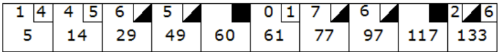

# Bowling Game Exercice

## Instructions (Try to not read ahead)

Scoring bowling

*Adapted from http://butunclebob.com/ArticleS.UncleBob.TheBowlingGameKata*

The game consists of 10 frames as shown above. In each frame the player has two opportunities to knock down 10 pins. The score for the frame is the total number of pins knocked down, plus bonuses for strikes and spares.

A spare is when the player knocks down all 10 pins in two tries. The bonus for that frame is the number of pins knocked down by the next roll. So in frame 3 above, the score is 10 (the total number knocked down) plus a bonus of 5 (the number of pins knocked down on the next roll.)

A strike is when the player knocks down all 10 pins on his first try. The bonus for that frame is the value of the next two balls rolled.

In the tenth frame a player who rolls a spare or strike is allowed to roll the extra balls to complete the frame. However no more than three balls can be rolled in tenth frame.

## Hosted version of the instructions

https://incycle-testing-labs.azurewebsites.net/bowling.html

## Partial solution

See partial solution/implementation in this repo.